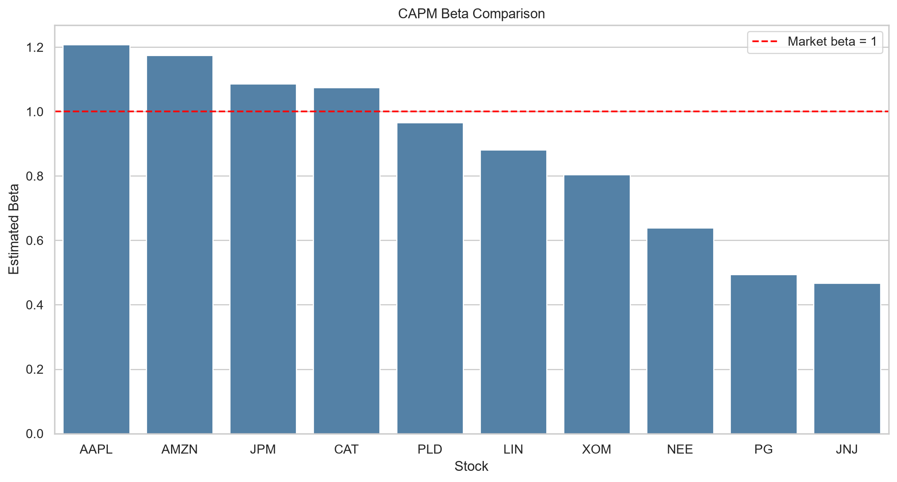

# CAPM Analysis of 10 U.S. Stocks

> Reproducible CAPM estimation, diagnostics, and beta-stability analysis for ten U.S. equities.


## Overview

This project estimates daily Capital Asset Pricing Model (CAPM) regressions for AAPL, JPM, JNJ, XOM, PG, CAT, NEE, AMZN, LIN, and PLD from 2016 through 2025. It uses the S&P 500 (`^GSPC`) as the market proxy and the FRED three-month Treasury series (`DGS3MO`) as the risk-free rate. The pipeline downloads and validates the data, fits OLS models, and produces cross-sectional, residual, rolling-beta, and subperiod outputs.

## Features

- Adjusted daily prices from Yahoo Finance, with a chart-API fallback
- Daily risk-free rates derived from the annualized FRED series
- OLS estimates of alpha, beta, p-values, and R-squared
- Residual diagnostics and fitted regression charts
- 252-trading-day rolling beta estimates
- Comparison of the 2016-2020 and 2021-2025 subperiods

## Installation

```powershell
python -m venv .venv
.\.venv\Scripts\Activate.ps1
python -m pip install -r requirements.txt
```

## Usage

Run these commands from the repository root:

```powershell
python .\src\download_data.py
python .\src\generate_outputs.py
```

The first command writes raw market data to `data/raw/` and the aligned CAPM dataset to `data/processed/capm_daily_data.csv`. The second command reads that processed file and regenerates the tables, regression summaries, and figures in `outputs/`.

For interactive analysis:

```powershell
jupyter notebook .\notebooks\capm_analysis.ipynb
```

## Project Structure

```text
CAPM/
|-- data/
|   |-- raw/                  # Downloaded prices, rates, and metadata
|   `-- processed/            # Aligned returns and excess returns
|-- notebooks/
|   `-- capm_analysis.ipynb   # Interactive analysis
|-- outputs/                  # Generated CSV, text, and PNG results
|-- reports/
|   `-- CAPM_Report.md        # Written findings and limitations
|-- src/
|   |-- download_data.py      # Data acquisition and preparation
|   `-- generate_outputs.py   # Regressions, diagnostics, and charts
`-- requirements.txt
```

## Results

The committed full-sample results contain 2,513 aligned trading-day observations. AAPL has the highest estimated beta (1.208), followed by AMZN (1.175); JNJ (0.467) and PG (0.494) have the lowest. AAPL also has the highest R-squared (0.568), while rolling and subperiod estimates show that beta changes over time.



See [`reports/CAPM_Report.md`](reports/CAPM_Report.md) for the full interpretation and limitations.

## Contributing

Open an issue before proposing substantial changes. Keep pull requests focused and include reproducible outputs or tests for changes to the data and modeling pipeline.

## License

Add your license here.
