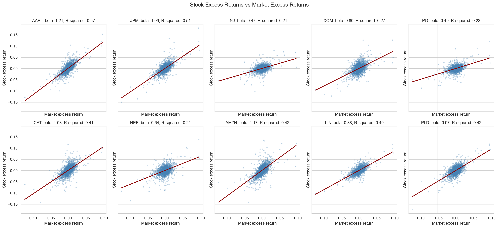
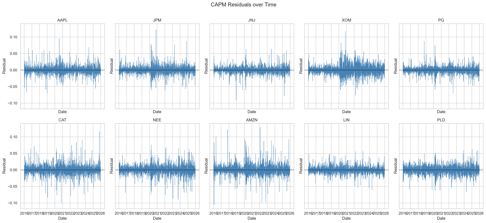
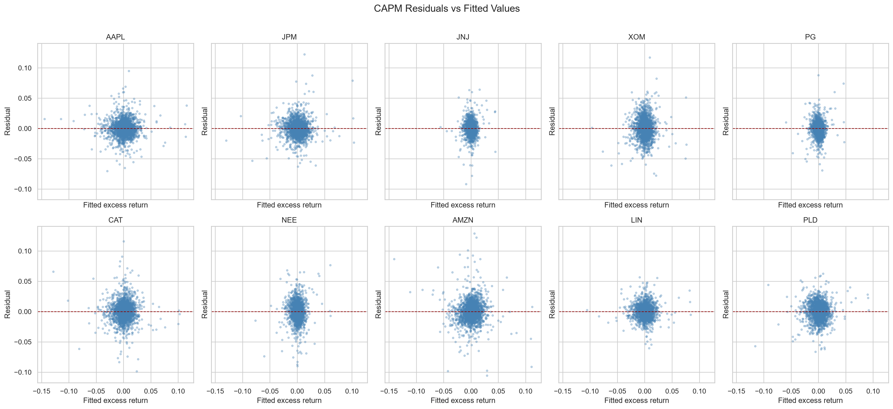
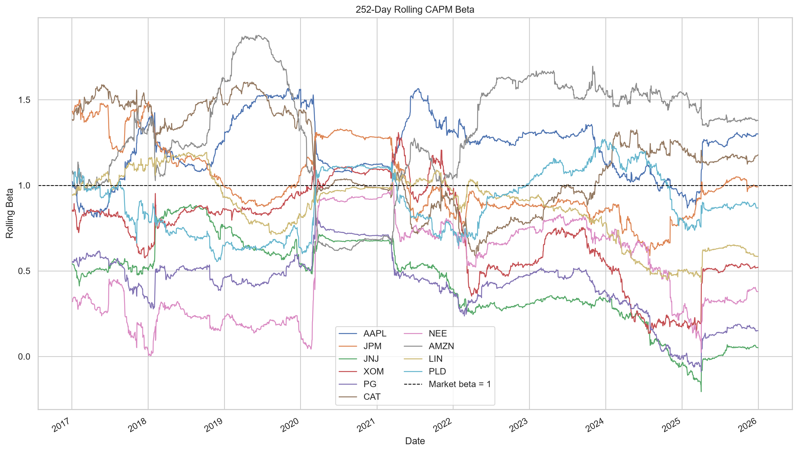

# CAPM Analysis of 10 U.S. Stocks

## Executive Summary

This project estimates the market exposure of ten U.S. stocks from different sectors using the Capital Asset Pricing Model (CAPM). Daily adjusted prices from Yahoo Finance, the S&P 500 as the market proxy, and the FRED three-month U.S. Treasury rate were used over 2016-2025. The final regression sample contains 2,513 daily observations for each stock.

The full-sample estimates show substantial cross-sectional variation in systematic risk. AAPL has the highest beta (1.208), followed by AMZN (1.175), while JNJ (0.467) and PG (0.494) have the lowest betas. This is broadly consistent with the expectation that technology and consumer-discretionary stocks are more market-sensitive, whereas health-care and consumer-staples stocks are more defensive. AAPL also has the highest R-squared (0.568), while the market explains only about 21%-23% of the daily excess-return variation in JNJ, NEE, and PG.

Most estimated alphas are not statistically different from zero. AAPL's positive daily alpha is marginally significant under conventional OLS inference (p = 0.042), but this result should be interpreted cautiously because ten stocks are tested simultaneously and daily residuals display large outliers and changing volatility. Rolling and subperiod estimates also demonstrate that beta is not constant through time.

## 1. Research Objective

The analysis addresses five questions:

1. Which stocks have betas above or below one?
2. Do defensive-sector stocks have lower market exposure?
3. Do any stocks exhibit statistically significant alpha?
4. How much of each stock's daily excess-return variation is explained by the market?
5. Do estimated betas remain stable across time and sample windows?

## 2. Data

### 2.1 Assets and sources

The sample consists of ten U.S. stocks from different sectors:

| Ticker | Sector |
|---|---|
| AAPL | Information Technology |
| JPM | Financials |
| JNJ | Health Care |
| XOM | Energy |
| PG | Consumer Staples |
| CAT | Industrials |
| NEE | Utilities |
| AMZN | Consumer Discretionary |
| LIN | Materials |
| PLD | Real Estate |

Yahoo Finance adjusted closing prices are used for the stocks and the S&P 500 (`^GSPC`). The FRED `DGS3MO` series is used as the risk-free-rate proxy. The study uses daily data from January 2016 through December 2025.

### 2.2 Data preparation

Simple daily returns are calculated from adjusted prices:

$$
R_{i,t}=\frac{P_{i,t}}{P_{i,t-1}}-1.
$$

The annualized Treasury rate, reported as a percentage, is converted to a daily rate using 252 trading days:

$$
R_{f,t}^{\text{daily}}=
\left(1+\frac{R_{f,t}^{\text{annual percentage}}}{100}\right)^{1/252}-1.
$$

Stock and market excess returns are then calculated as:

$$
R_{i,t}^{e}=R_{i,t}-R_{f,t},
\qquad
R_{m,t}^{e}=R_{m,t}-R_{f,t}.
$$

Dates are aligned across stocks, the market, and the risk-free series. The processed regression dataset has 2,513 rows, no missing observations, no duplicate dates, and is sorted chronologically.

## 3. Methodology

For each stock, the following time-series regression is estimated by ordinary least squares:

$$
R_{i,t}-R_{f,t}
=
\alpha_i
+
\beta_i(R_{m,t}-R_{f,t})
+
\epsilon_{i,t}.
$$

The estimated coefficients are interpreted as follows:

- **Alpha** is the average daily excess return not explained by contemporaneous market excess returns.
- **Beta** measures the stock's sensitivity to the market. A beta above one indicates greater market sensitivity; a beta below one indicates lower sensitivity.
- **R-squared** measures the proportion of the stock's daily excess-return variation explained by the market factor.
- **p-values** assess whether the estimated alpha or beta differs statistically from zero under the baseline OLS assumptions.

To examine parameter stability, a 252-trading-day rolling beta is calculated as:

$$
\beta_{i,t}^{(252)}=
\frac{\operatorname{Cov}_{252}(R_i^e,R_m^e)}
{\operatorname{Var}_{252}(R_m^e)}.
$$

The full sample is also divided into 2016-2020 and 2021-2025 subperiods.

## 4. Full-Sample Regression Results

| Ticker | Daily Alpha | Beta | Alpha p-value | Beta p-value | R-squared |
|---|---:|---:|---:|---:|---:|
| AAPL | 0.000488 | 1.208 | 0.042 | <0.001 | 0.568 |
| AMZN | 0.000367 | 1.175 | 0.242 | <0.001 | 0.422 |
| JPM | 0.000308 | 1.086 | 0.204 | <0.001 | 0.510 |
| CAT | 0.000542 | 1.075 | 0.065 | <0.001 | 0.412 |
| PLD | 0.000166 | 0.966 | 0.521 | <0.001 | 0.419 |
| LIN | 0.000247 | 0.882 | 0.232 | <0.001 | 0.487 |
| XOM | 0.000042 | 0.805 | 0.888 | <0.001 | 0.274 |
| NEE | 0.000294 | 0.639 | 0.297 | <0.001 | 0.212 |
| PG | 0.000102 | 0.494 | 0.622 | <0.001 | 0.228 |
| JNJ | 0.000160 | 0.467 | 0.435 | <0.001 | 0.213 |

All beta estimates are statistically different from zero at conventional levels. This does not mean all stocks have the same market exposure: the magnitude of beta varies from 0.467 for JNJ to 1.208 for AAPL.

### 4.1 Beta comparison


AAPL, AMZN, JPM, and CAT have betas above one. Their excess returns therefore tend to move more than one-for-one with market excess returns. PLD is close to the market benchmark with a beta of 0.966. JNJ, PG, NEE, XOM, and LIN have betas below one.

The low betas of JNJ and PG support the defensive-sector hypothesis. Their products and revenues may be less sensitive to the business cycle than technology, discretionary-consumption, or financial activity. NEE also has a low full-sample beta, consistent with a defensive utility classification.

### 4.2 Alpha and statistical significance

AAPL has a daily alpha of 0.000488, or approximately 4.88 basis points per trading day, with a conventional OLS p-value of 0.042. It is the only full-sample alpha below the 5% p-value threshold. CAT has a positive alpha with a p-value of 0.065, which does not meet the 5% threshold. The remaining stocks provide no statistically significant evidence of non-zero alpha.

The AAPL result is best described as marginal rather than definitive. First, the p-value is close to 0.05. Second, ten separate alpha tests create a multiple-testing concern. Third, the residual plots suggest outliers and time-varying volatility, which may make conventional OLS standard errors too optimistic. Historical alpha also should not be interpreted as a forecast of future abnormal performance.

### 4.3 Explanatory power

AAPL has the highest R-squared at 0.568, meaning that contemporaneous market excess returns explain approximately 56.8% of its daily excess-return variation. JPM and LIN also show relatively high market explanatory power, with R-squared values of 0.510 and 0.487.

At the lower end, NEE, JNJ, and PG have R-squared values close to 0.21-0.23. Their lower R-squared values do not imply poor performance or invalid regressions. They indicate that company-specific, industry-specific, and omitted systematic factors account for a larger share of their daily movements.

## 5. Excess-Return Scatter Plots



The positive fitted slopes confirm that all ten stocks have positive market exposure. AAPL and AMZN have relatively steep regression lines, while JNJ and PG have flatter lines. The dispersion around each fitted line reflects idiosyncratic variation not explained by the single market factor. Large observations appear in both market and stock excess returns, particularly around high-volatility periods.

## 6. Residual Diagnostics



Residuals are generally centered around zero, as expected for OLS models with an intercept. However, their magnitude is not constant through time. Several stocks show clusters of larger residuals around 2020 and in later volatile periods. AMZN, CAT, JPM, XOM, and PLD display notable residual spikes, while even defensive stocks show occasional large unexplained movements.



The residual-versus-fitted plots contain outliers and suggest that dispersion can change with the magnitude of fitted returns. These visual patterns are inconsistent with a strong assumption of perfectly constant residual variance. The baseline OLS coefficients remain useful as descriptive estimates, but robust or heteroskedasticity-and-autocorrelation-consistent standard errors would be a valuable extension for formal inference.

## 7. Rolling Beta and Stability



The rolling estimates show that beta changes materially through time. AMZN has the highest average rolling beta (1.321) and the widest range among the major high-beta stocks, reaching approximately 1.876. AAPL's rolling beta averages 1.219 and ranges from approximately 0.813 to 1.566. CAT also moves substantially, with rolling estimates from about 0.577 to 1.604.

Defensive classifications are not perfectly stable. JNJ's rolling beta ranges from approximately -0.206 to 0.888, while PG ranges from approximately -0.090 to 0.868. Short periods of near-zero or negative rolling beta should be interpreted cautiously because rolling estimates are sensitive to the selected window and unusual observations. Nevertheless, the broad changes demonstrate that beta is not a fixed company characteristic.

## 8. Subperiod Comparison

The two five-year windows reveal economically meaningful shifts:

- **AAPL:** beta rises from 1.179 in 2016-2020 to 1.245 in 2021-2025. Its positive alpha is significant in the first period (p = 0.015) but not in the second (p = 0.730).
- **AMZN:** beta rises sharply from 0.935 to 1.484, while its alpha changes from positive and significant in the first period to negative and insignificant in the second.
- **JPM:** beta falls from 1.236 to 0.893, and R-squared declines from 0.606 to 0.390.
- **JNJ:** beta falls from 0.662 to 0.217, and R-squared falls from 0.410 to 0.048, indicating very limited market explanatory power in the second period.
- **XOM:** beta falls from 1.010 to 0.540, while alpha changes from negative to positive, although neither subperiod alpha reaches the 5% significance threshold.
- **PG, NEE, CAT, LIN, and PLD:** most also show lower second-period betas, though the size of the change differs by company.

These shifts reinforce the rolling-beta conclusion: full-sample beta is an average across changing market regimes and should not be treated as permanently stable.

## 9. Limitations

1. The S&P 500 is a practical market proxy but does not represent the complete investable market portfolio envisioned by CAPM theory.
2. CAPM contains only one systematic factor. Size, value, profitability, investment, momentum, interest-rate, and sector factors are omitted.
3. Conventional OLS p-values rely on assumptions that may be challenged by heteroskedasticity, volatility clustering, and non-normal daily returns.
4. The selected stocks are large, currently prominent U.S. companies. The sample may therefore contain selection and survivorship bias.
5. Beta and alpha estimates depend on data frequency, estimation window, and market regime.
6. The 252-day rolling window balances responsiveness and estimation noise, but other window choices would produce different paths.
7. Statistical significance in the historical sample does not imply economic persistence or future abnormal returns.

## 10. Conclusion

The results support the view that market exposure differs materially across firms and sectors. AAPL, AMZN, JPM, and CAT have full-sample betas above one, while JNJ, PG, and NEE exhibit substantially lower sensitivity. The defensive behavior of health-care, consumer-staples, and utility stocks is therefore visible in the estimated betas, although it is not perfectly stable over time.

The market factor explains a meaningful but incomplete share of daily stock-return variation. Explanatory power ranges from approximately 21% to 57%, leaving considerable room for firm-specific shocks and omitted systematic factors. Most stocks do not exhibit significant alpha, which is broadly consistent with the CAPM benchmark. AAPL is the only marginal exception under baseline OLS inference, but the result warrants caution.

Finally, the rolling and subperiod analyses show that beta changes across market conditions. A single full-sample beta is useful as a summary statistic, but it can conceal large changes in risk exposure. For practical risk management, beta should be treated as an estimated, time-dependent quantity rather than a permanent attribute.

## Reproducibility

The data pipeline and output pipeline can be rerun from the CAPM project directory:

```powershell
.\.venv\Scripts\python.exe .\src\download_data.py
.\.venv\Scripts\python.exe .\src\generate_outputs.py
```

The first command updates the raw and processed data. The second command regenerates all result tables, regression summaries, diagnostic charts, rolling-beta outputs, and subperiod comparisons.
